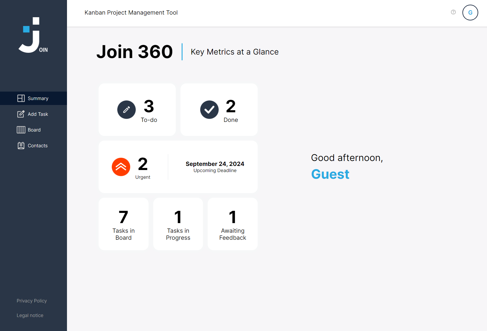

JOIN Project

overview
Welcome to the JOIN Project! This project is made from contributions from an open-source joint project and is designed to enhance productivity with a Kanban-inspired task manager. With JOIN, you can easily create tasks, drag and drop to organize them, assign users, and categorize tasks for streamlined project tracking. Whether you're managing a small team or a large project, JOIN provides an intuitive interface to help you stay on top of your tasks and improve your workflow.

Features
Task Creation: Easily create new tasks with just a few clicks.
Drag and Drop: Organize your tasks by dragging and dropping them across different columns.
User Assignment: Assign tasks to specific users to track accountability.
Categorization: Categorize tasks to keep your project organized and focused.
Kanban Board: Visualize your workflow with a Kanban board, making it easier to manage tasks and project progress.

Usage
Creating Tasks: Click on the "Add Task" button to create a new task. Fill in the task details and save.
Organizing Tasks: Drag and drop tasks between columns to move them through different stages of your workflow.
Assigning Users: Click on a task to open the task details. From there, you can assign the task to a user.
Categorizing Tasks: Use categories to group related tasks together for better organization.
Learning Purpose Only
This project is intended for educational purposes only and may not be used for commercial purposes.

## Screenshots

## Author
Aristotelis Stratis - [GitHub Profile](https://github.com/prashantmishra009)
